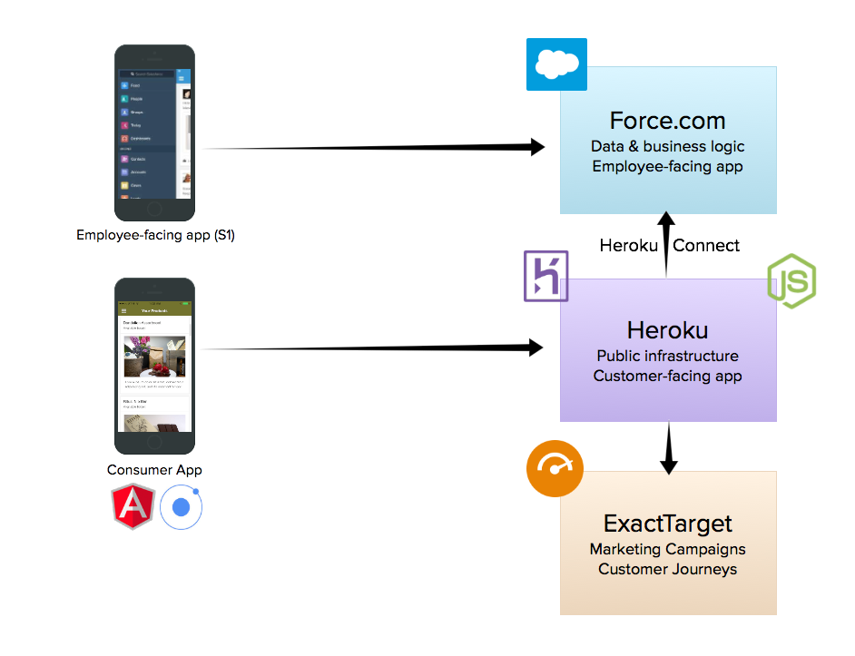
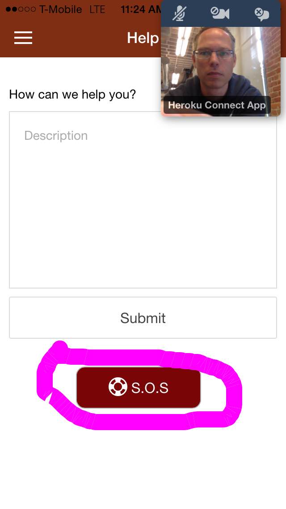

## Client-Side (Consumer App)

The consumer app is a multi-platform hybrid application packaged with [Apache Cordova](https://cordova.apache.org/), enabling easy distribution on the different app stores. It is built as a single page application with [AngularJS](https://angularjs.org/) and [Ionic](http://ionicframework.com/). It runs on iOS, Android, Windows Phone, etc.  

## Client-Side (Employee-Facing)

Nibs Employees manage the application data (create offers, products, etc) in Salesforce in the browser or in the Salesforce1 mobile app. The employee-facing application is built using Salesforce declarative features with clicks not code. 

## Server-Side

The server-side of the consumer app runs on Heroku and is built with [Node.js](http://nodejs.org/), [Express](http://expressjs.com/), and [Postgres](https://www.heroku.com/postgres).

The server-side application exposes its own REST endpoints. The client application gets its data by invoking these REST services. These are API calls to your own application (the Nibs server), and they don't count towards Salesforce API limits.

## Salesforce Integration

The application data is maintained in Salesforce. **Heroku Connect** synchronizes the Salesforce data with a Postgres database running in Heroku.

Heroku Connect synchronizes the following Salesforce objects:

- Contact (Bidirectional sync)
- Campaign (Read only)
- Product2 (Read only)
- Interaction__c (Bidirectional sync)
- Store__c (Read only)

Using Heroku Connect:
 
 - Consumers access the application data in Postgres through the application's own REST services 
 - Developers write the data data access layer using SQL against the Postgres database
 - The data is kept in sync using Connect's bi-directional data synchronization
 
## Salesforce Communities

The _Stories_ page in the Nibs application is powered by the Salesforce Communities product. The key
to this is the integrated authentication that allows the user logged into the Nibs 
app to authenticate into the Communities system. This integration uses the Salesforce 
[External Authentication Provider](https://help.salesforce.com/apex/HTViewHelpDoc?id=sso_provider_openid_connect.htm&language=en_US)
mechansim which allows the Nibs server to act as an [Open ID Connect](http://openid.net/connect/) provider
in order to authenicate Nibs users as Communuities users.

Follow [these instructions](communities.html) to configure Communities support in your instance
of Nibs.

## ExactTarget Push Notification

Push Notification is implemented using the ExactTarget Mobile Push APIs and is documented on [this page](push.html)

## ExactTarget Journey Builder

Checkout the [Journey Builder Hello World](https://github.com/ExactTarget/journey-builder-custom-hello-world) application
for an example of how to create custom triggers and activities in Journey Builder which can be integrated into
your app. For Nibs we created Journey Builder endpoints in the Node application which communicated with the 
client app.

## SOS

**SOS** is a feature of Service Cloud where you put a _Video Help_ button into your app which enables your
app's users to open a video chat directly with a service agent. SOS integrates with your app via an 
[iOS SDK](https://github.com/goinstant/sos-guides). The SOS functions can be exposed via an Apache Cordova
plugin to the Javascript in the Nids Angular App. Simply connect a new button to invoke the 
`SOS Application:startSession` method.

## User Management

- User can sign up and create an account in the application or login with Facebook.
- Nibs users are stored as Contacts in Salesforce.
- User passwords are hashed with bcrypt using a per-user salt.
- The application generates its own authorization tokens that the client passes in the header of each request.

## Facebook Integration

- Facebook integration is performed using [OpenFB](https://github.com/ccoenraets/OpenFB).
- In addition to login, Nibs gets the user's profile picture and email address from Facebook.
- If that email address is already assigned to a Contact in Salesforce, the two accounts are reconciled. If not, a new contact is created.
- The Facebook integration also allows users to share application content (offers and products) on their feed.

## Camera Integration

- Profile picture: The user can change his/her profile picture by either taking a selfie on the device, or choosing an existing picture from the device camera roll.
- Instagram-like feature: The user can take pictures and share them with the community.
