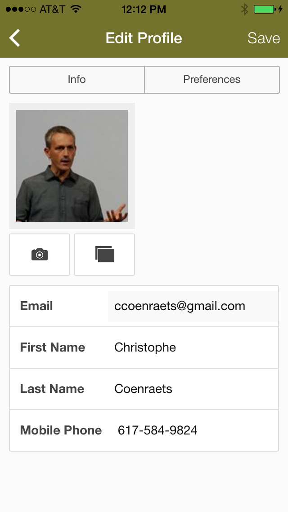
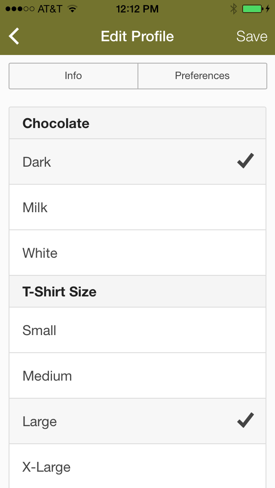
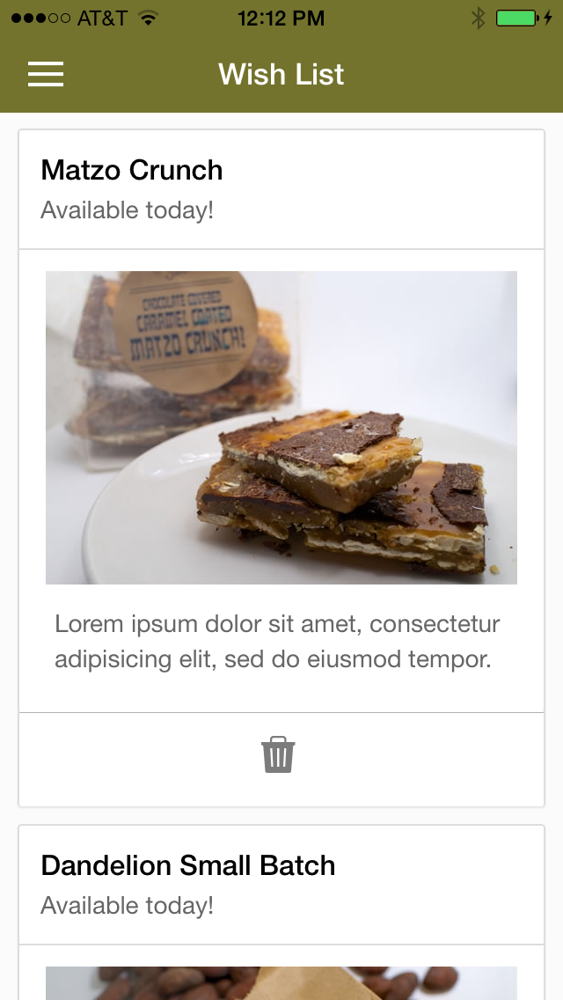
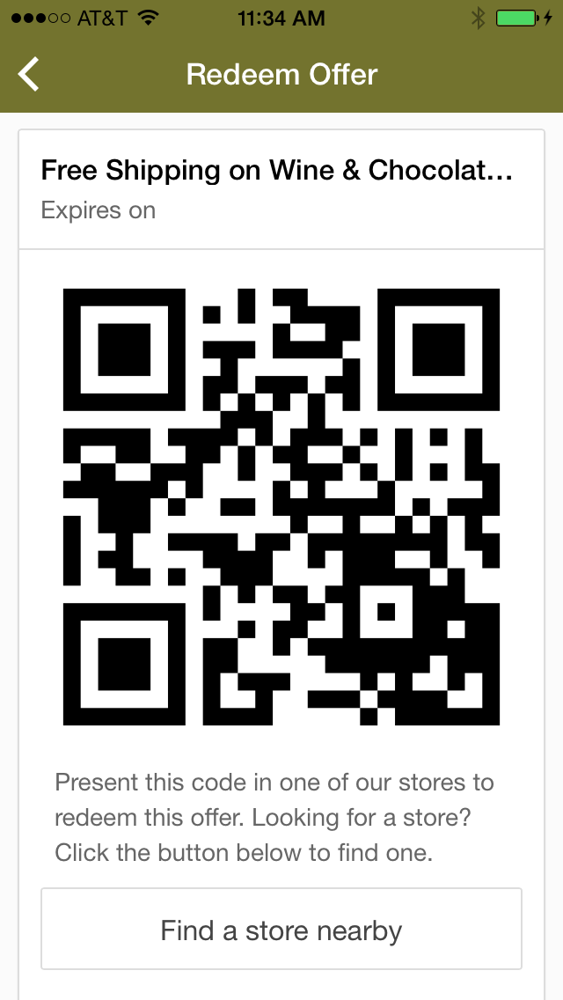
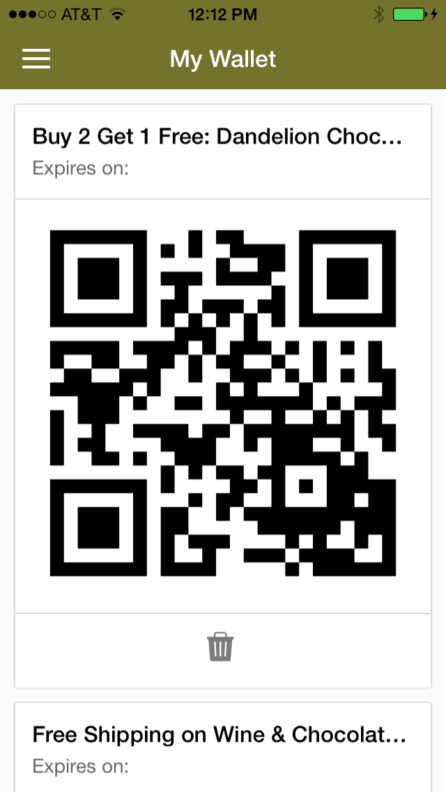
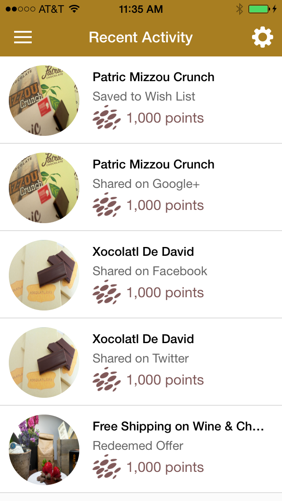
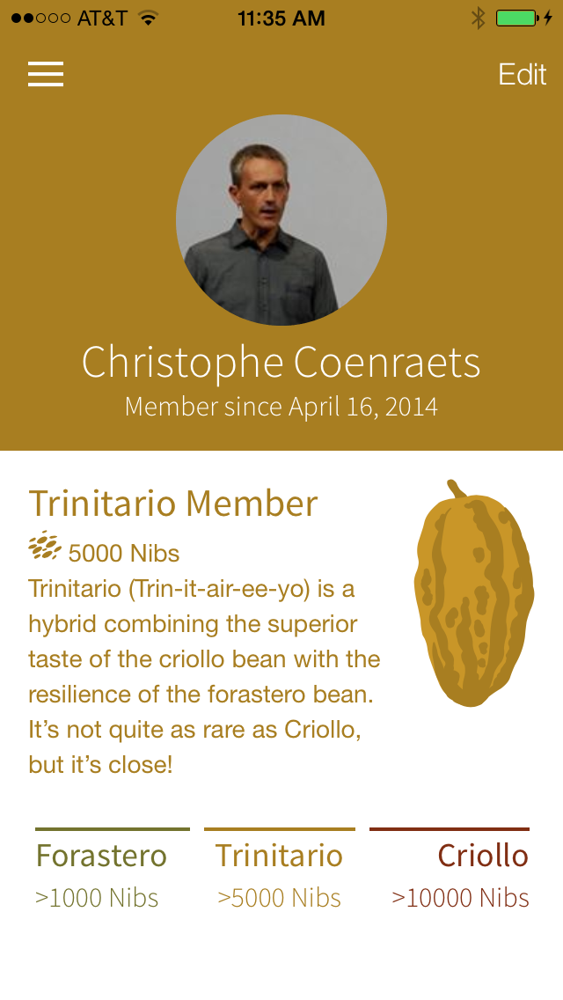
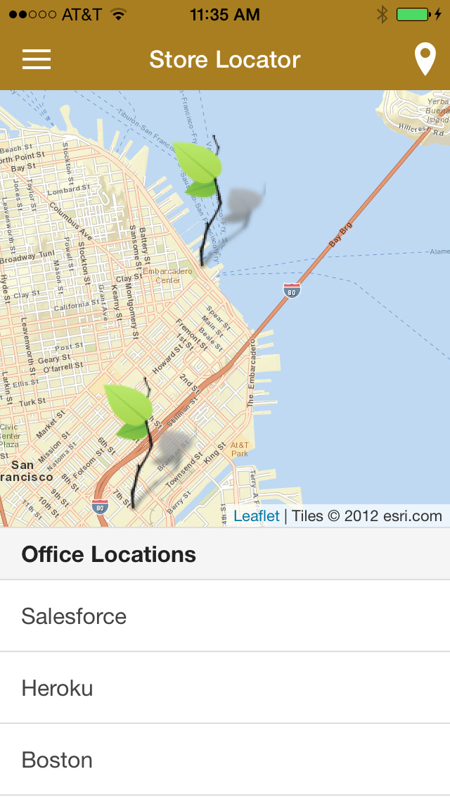
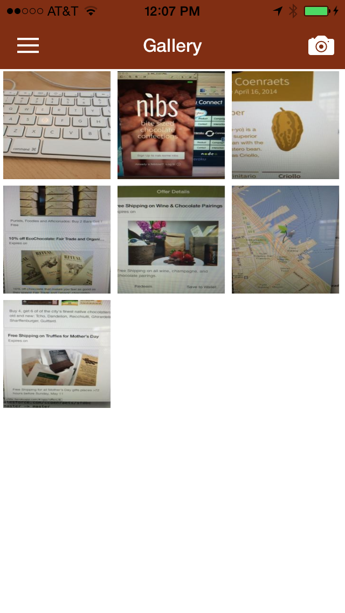

## Sign Up and Login

- You can sign up and create an account in the application, or login with Facebook.
- Nibs users are managed in the Contact table in Postgres. If you configured the Salesforce integration, the Contact table is automatically synchronized with the Contact object in Salesforce.
- If the user logged in with Facebook, Nibs gets the user's profile picture and email address from Facebook. If that email address is already assigned to a Contact, the two accounts are reconciled. If not, a new Contact is created.
- User passwords are hashed with bcrypt using a per-user salt.
- The application generates its own authorization tokens that the client passes in the header of each request.

## Profile and Preferences

- Users can edit their profile and preferences. This information is saved in the Contact table in Postgres (and synchronized with the Contact object in Salesforce if you configured Salesforce integration).

## Products

- Products come from the Product2 table in Postgres. If you configured Salesforce integration, the Product2 table is automatically synchronized with the Product2 object in Salesforce.
- You can add a product to your wish list or share products on social networks

## Offers

- Offers come from the Campaign table. If you configured Salesforce integration, the Campaign table is automatically synchronized with the Campaign object in Salesforce.
- You can redeem an offer, add an offer to your wallet, or share offers on social networks

When redeeming an offer, you are presented with a QR code that you can present in a store. Alternatively, you can save the offer to your wallet to redeem it later.

## Activity and Point System

In Nibs, you earn points for performing specific activities in the application: sharing products and campaigns on social networks, redeeming an offer, saving an offer to your wallet, saving a product to your wish list, etc. 
Activities are stored in the Interaction\_\_c table in Postgres. If you configured Salesforce integration, the Interaction\_\_c table is automatically synchronized with the Interaction\_\_c object in Salesforce.

The Recent Activity screen shows the activities you performed and the points you earned:

When you earn enough points, your status gets upgraded to a higher level. The three status levels in Nibs are:

- **Forastero**: 0 to 4999 points
- **Trinitario**: 5000 to 9999 points
- **Criollo**: &gt;9999 points

Nibs notifies you in real time when your status gets upgraded. The application color theme automatically changes to reflect your new status.

For demo purpose, you can delete your activities in the application: go to the the side menu, select Settings, and tap the Delete Activities button. That will set you back to the lowest level (Forastero). Then perform 5 activities in the app (share, redeem, or save) and you will see your status change including the color theme change.

## Store Locator

The store locator uses the Geolocation API to center the map on your current location. It also shows you the stores nearby. You can click a store in the store list to center the map on that store's location.

## Photo Sharing

Nibs has an instagram-like feature that lets users to share pictures featuring Nibs products.

## Push Notification

The Push notification use cases are documented on [this page](push.html)
